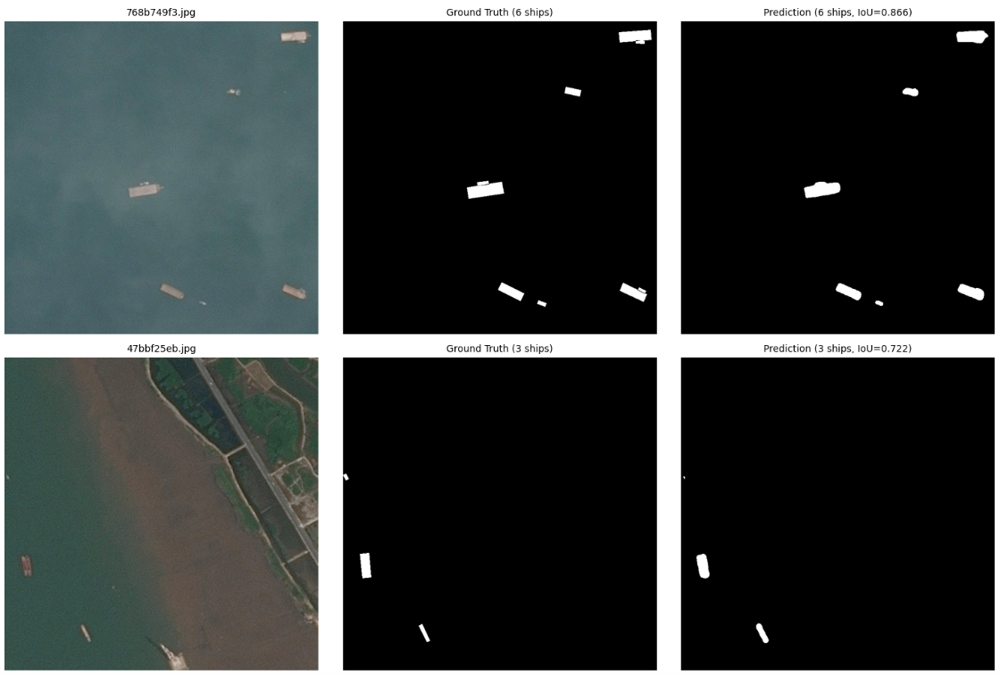

# Ship Detection — Satellite Image Segmentation

Semantic segmentation model that detects ships in satellite imagery. The project is based on the [Airbus Ship Detection Challenge](https://www.kaggle.com/c/airbus-ship-detection) dataset — 192k satellite photos at 768×768 resolution, where each image may contain zero, one, or dozens of ships. Ground truth masks are stored in run-length encoding (RLE) format.

The core model is an FPN (Feature Pyramid Network) with a ResNet34 encoder, trained through several stages to reach **0.83 IoU** on validation. I also experimented with SegFormer, YOLOv11, and an ensemble approach, but FPN alone outperformed all alternatives.

The trained model is converted to ONNX with FP16 quantization, wrapped in a FastAPI web app, and deployed to AWS with a full CI/CD pipeline.

**[Try the live demo](https://ip-172-31-26-187.tail160214.ts.net/)** (sample images for testing are in the `photos/` directory)



---

## Results

Validation set metrics:

| Metric | Value |
|--------|-------|
| Pixel Dice (F1) | 0.910 |
| Pixel Precision | 0.909 |
| Pixel Recall | 0.911 |
| Ship-level Precision (IoU ≥ 0.5) | 0.816 |
| Ship-level Recall (IoU ≥ 0.5) | 0.722 |
| Ship-level F1 (IoU ≥ 0.5) | 0.766 | 
| Mean IoU | 0.665 | 

The IoU is somewhat lower than it could be because the ground truth annotations in this dataset are axis-aligned bounding boxes, while the model outputs actual contour-level masks that follow the ship shape so any comparison penalizes the model for being more precise than the labels.


## Model and Training

I used FPN with a ResNet34 backbone pretrained on ImageNet, implemented via [segmentation-models-pytorch](https://github.com/qubvel-org/segmentation-models-pytorch). I chose FPN because its multi-scale feature pyramids handle both large cargo ships and small boats well.

The dataset is heavily imbalanced: the majority of images contain no ships, and where ships are present they occupy a small fraction of the image. I applied negative downsampling to 10%, keeping only a tenth of empty images during training. The model outputs a binary mask, which is then split into individual ships via connected components with a minimum size filter of 20 pixels.

Training went through three stages:

1. Baseline (30 epochs) — BCE + Dice loss, learning rate 1e-4, resolution 512×512. Reached 0.78 IoU.

2. Lovász finetuning, phase 1 (10 epochs) — switched to BCE + Lovász loss at 512×512, learning rate reduced to 5e-5. Lovász is a smooth surrogate for IoU, so it directly optimizes the target metric.

3. Lovász finetuning, phase 2 (20 epochs) — same loss, resolution increased to 768×768, learning rate 2e-5. Reached **0.83 IoU**.

### Other experiments

SegFormer (MIT-B1) reached 0.80 IoU after 30 epochs and had the lowest validation loss among all models. However, it produced a high number of false positives and missed many ships entirely, which hurt its practical performance despite the decent IoU.

YOLOv11-seg reached 0.80 mAP50 after 60 epochs. Ship-level detection was strong with minimal false positives and few missed ships. The problem was mask quality — YOLO's backbone downscales images to around 200 pixels, so the output masks were coarse rectangles rather than precise contours. Combined with the already rectangular ground truth, this led to low overlap scores.

YOLO + SegFormer ensemble — I combined the strengths of both: SegFormer generates the masks, then YOLO validates whether each detection is real (confidence threshold 0.15), filtering out SegFormer's false positives. This gave roughly a 9% improvement over either model alone. But after switching to FPN with progressive training and Lovász loss, FPN matched or exceeded the ensemble results with a single model — so I went with that.


## Inference and ONNX

For production I use the model in ONNX format with FP16 quantization, which cuts the size roughly in half without affecting prediction quality. The ONNX predictor (`src/inference/onnx_predictor.py`) depends only on `onnxruntime`, `numpy`, `opencv`, and `Pillow` — keeping the production image lightweight.

There is also a full PyTorch predictor with test-time augmentation and Kaggle submission CSV generation for evaluation purposes.

The model is stored on HuggingFace Hub and downloaded during the Docker build.

## CI/CD and Deployment

I set up a GitHub Actions pipeline:

- **Lint** — Ruff checks style and formatting
- **Type check** — MyPy across the full codebase
- **Tests** — pytest covering dataset loading, loss functions, RLE encoding, ONNX conversion, inference, and FastAPI routes
- **Docker build** — multi-architecture image (amd64 + arm64), pushed to GitHub Container Registry
- **Smoke tests** — pulls the built image, starts a container, validates health and index endpoints

The production deployment runs on an AWS EC2 t4g.small ARM instance. The Docker image is pulled from GHCR, and HTTPS is provided by Tailscale Funnel.


### Web Application

The frontend is a FastAPI app with a simple HTML/JS interface — upload a satellite image and get the ship count with a visual overlay of detected areas. The full web app code is in `src/web/`.

---

## Project Structure

```
├── src/
│   ├── training/              # ShipDataset, data module, Lightning trainer, loss functions
│   ├── inference/             # PyTorch predictor (TTA, submission CSV) + ONNX predictor
│   ├── web/                   # FastAPI app, HTML template, CSS
│   └── utils.py               # RLE encode/decode
│
├── entrypoint/                # CLI entry points for training and batch inference
├── scripts/                   # ONNX conversion script
├── tests/                     # Unit tests
│
├── Dockerfile
├── .github/workflows/ci.yml
├── requirements.txt           # Training: PyTorch, Lightning, SMP, Albumentations
└── requirements-web.txt       # Inference: FastAPI, ONNX Runtime, OpenCV
```


## Tech Stack

**Training:** PyTorch, PyTorch Lightning, Segmentation Models PyTorch, Albumentations

**Inference:** ONNX Runtime, OpenCV, NumPy

**Web:** FastAPI, HTML/CSS, JavaScript

**CI/CD:** GHA, Ruff, MyPy, pytest

**Infrastructure:** Docker, AWS EC2, GHCR, HuggingFace Hub, Tailscale
